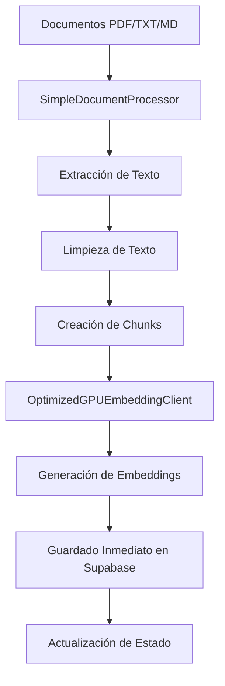

# Sistema RAG Optimizado con Guardado Inmediato

## 📋 Descripción General

Este proyecto implementa un sistema RAG (Retrieval-Augmented Generation) ultra-optimizado para procesar documentos y generar embeddings con guardado inmediato. El sistema está diseñado para manejar miles de documentos de manera eficiente, utilizando técnicas avanzadas de procesamiento paralelo y generación de embeddings con Hugging Face.

## 🏗️ Arquitectura del Sistema

### Componentes Principales

1. **Sistema RAG Optimizado** (`optimized_immediate_save.py`)
   - Procesamiento masivo paralelo con hasta 20 workers
   - Guardado inmediato de chunks para evitar pérdida de datos
   - Integración con Supabase para almacenamiento
   - Cliente optimizado para API de Hugging Face

2. **Procesador de Documentos Simple** (`simple_document_processor.py`)
   - Procesamiento robusto de PDFs, TXT y MD
   - Chunking inteligente con overlap
   - Extracción de metadatos y limpieza de texto
   - Manejo de errores robusto

3. **Configuración de Supabase** (`config_supabase.py`)
   - Configuración centralizada de la base de datos
   - Variables de entorno y parámetros optimizados
   - Configuración de embeddings y chunking

4. **Sistema Ultra Simple** (`ultra_simple_processing.py`)
   - Sistema alternativo simplificado
   - Procesamiento básico para casos de uso simples

### Archivos de Base de Datos

5. **Esquema de Base de Datos** (`supabase_schema_siem.sql`)
   - Definición completa de tablas y relaciones
   - Índices optimizados para búsqueda
   - Funciones RPC para búsqueda híbrida

6. **Políticas de Seguridad** (`setup_rls_policies.sql`)
   - Configuración de Row Level Security (RLS)
   - Políticas de acceso para usuarios anónimos
   - Seguridad a nivel de fila

7. **Utilidades de Base de Datos** (`check_table_structure.sql`)
   - Scripts para verificar estructura de tablas
   - Herramientas de diagnóstico
   - Verificación de integridad

## 📁 Estructura del Proyecto

```
Embeddings/
├── optimized_immediate_save.py      # Sistema RAG principal
├── simple_document_processor.py     # Procesador de documentos
├── ultra_simple_processing.py       # Sistema alternativo simple
├── config_supabase.py              # Configuración de Supabase
├── requirements.txt                 # Dependencias Python
├── README.md                       # Documentación principal
├── supabase_schema_siem.sql        # Esquema de base de datos
├── setup_rls_policies.sql          # Políticas de seguridad
├── check_table_structure.sql       # Utilidades de BD
├── src/                           # Código fuente adicional
│   └── __init__.py
├── data/                          # Datos de procesamiento
├── cache/                         # Cache del sistema
├── logs/                          # Archivos de log
└── leyes_de_todos_los_estados/    # Documentos de ejemplo
    ├── aguascalientes/
    ├── baja_california/
    └── ... (32 estados)
```

## 🚀 Cómo Funciona el Sistema

### 1. Flujo de Procesamiento



### 2. Procesamiento de Documentos

#### Extracción de Texto
```python
def _extract_pdf_text(self, file_path: Path) -> str:
    doc = fitz.open(str(file_path))
    text = ""
    
    for page_num in range(len(doc)):
        page = doc.load_page(page_num)
        page_text = page.get_text()
        if page_text.strip():
            text += f"\n--- PÁGINA {page_num + 1} ---\n{page_text}\n"
    
    doc.close()
    return text
```

#### Chunking Inteligente
- **Tamaño máximo de chunk:** 2000 caracteres
- **Overlap:** 200 caracteres
- **Puntos de corte naturales:** Puntos, comas, saltos de línea
- **Filtrado:** Chunks mínimos de 50 caracteres

### 3. Generación de Embeddings

#### Cliente Optimizado
```python
class OptimizedGPUEmbeddingClient:
    def __init__(self, hf_endpoint: str, hf_token: Optional[str] = None):
        self.batch_size = 32  # Límite máximo de la API
        self.max_concurrent_requests = 20
        self.semaphore = asyncio.Semaphore(20)
```

#### Características del Cliente
- **Procesamiento en lotes:** 32 textos por lote
- **Control de concurrencia:** Máximo 20 requests simultáneos
- **Rate limiting:** Control automático de velocidad
- **Manejo de errores:** Retry automático y circuit breaker

### 4. Guardado Inmediato

#### Ventajas del Guardado Inmediato
- **Sin pérdida de datos:** Los chunks se guardan inmediatamente
- **Recuperación de errores:** Proceso puede reanudarse
- **Monitoreo en tiempo real:** Progreso visible
- **Memoria eficiente:** No acumula datos en memoria

#### Proceso de Guardado
```python
async def _save_chunks_and_embeddings_batch(self, chunks, embeddings_data, document_id):
    # Preparar datos de chunks
    chunks_data = []
    for chunk in chunks:
        chunk_data = {
            'document_id': document_id,
            'chunk_text': chunk['text'],
            'chunk_text_clean': chunk.get('clean_text', chunk['text']),
            'chunk_type': chunk.get('chunk_type', 'paragraph'),
            'chunk_index': chunk.get('chunk_index', 0),
            'word_count': chunk.get('word_count', 0),
            'char_count': chunk.get('char_count', 0),
            'chunk_hash': chunk.get('chunk_hash', ''),
            'created_at': datetime.now().isoformat()
        }
        chunks_data.append(chunk_data)
    
    # Insertar en lote
    chunks_result = self.supabase.table('siem_chunks').insert(chunks_data).execute()
```

## 🗄️ Estructura de Base de Datos

### Tabla `siem_documents`
```sql
CREATE TABLE siem_documents (
    id SERIAL PRIMARY KEY,
    file_name TEXT NOT NULL,
    file_path TEXT NOT NULL,
    file_hash TEXT UNIQUE NOT NULL,
    file_size BIGINT,
    file_extension TEXT,
    processing_status TEXT DEFAULT 'pending',
    created_at TIMESTAMP DEFAULT NOW(),
    updated_at TIMESTAMP DEFAULT NOW()
);
```

### Tabla `siem_chunks`
```sql
CREATE TABLE siem_chunks (
    id SERIAL PRIMARY KEY,
    document_id INTEGER REFERENCES siem_documents(id),
    chunk_text TEXT NOT NULL,
    chunk_text_clean TEXT,
    chunk_type TEXT DEFAULT 'paragraph',
    chunk_index INTEGER,
    word_count INTEGER,
    char_count INTEGER,
    chunk_hash TEXT,
    created_at TIMESTAMP DEFAULT NOW()
);
```

### Tabla `siem_embeddings`
```sql
CREATE TABLE siem_embeddings (
    id SERIAL PRIMARY KEY,
    chunk_id INTEGER REFERENCES siem_chunks(id),
    embedding_vector VECTOR(768),
    dimensions INTEGER,
    model_name TEXT DEFAULT 'qwen3-gpu-optimized',
    created_at TIMESTAMP DEFAULT NOW()
);
```

## 🛠️ Instalación y Configuración

### Requisitos del Sistema
```bash
pip install -r requirements.txt
```

### Dependencias Principales
- `supabase` - Cliente de Supabase
- `aiohttp` - Cliente HTTP asíncrono
- `PyMuPDF` - Procesamiento de PDFs
- `numpy` - Operaciones numéricas
- `asyncio` - Programación asíncrona

### Variables de Entorno
```bash
export SUPABASE_URL="tu_url_supabase"
export SUPABASE_KEY="tu_clave_supabase"
export HF_TOKEN="tu_token_huggingface"  # Opcional
```

## 🚀 Uso del Sistema

### Procesamiento Básico
```python
from optimized_immediate_save import OptimizedImmediateSaveRAGSystem

# Inicializar sistema
system = OptimizedImmediateSaveRAGSystem(
    supabase_url="https://tu-proyecto.supabase.co",
    supabase_key="tu_clave_supabase",
    hf_endpoint="https://tu-endpoint.huggingface.cloud"
)

# Procesar documentos
results = await system.process_documents_immediate_save(
    source_directory="ruta/a/documentos",
    max_workers=20,
    max_files=100
)
```

### Procesamiento Masivo
```python
# Ejecutar desde línea de comandos
python optimized_immediate_save.py
```

### Configuración Avanzada
```python
# Personalizar parámetros
system = OptimizedImmediateSaveRAGSystem(
    supabase_url=SUPABASE_URL,
    supabase_key=SUPABASE_KEY,
    hf_endpoint=HF_ENDPOINT,
    hf_token=HF_TOKEN
)

# Procesar con parámetros específicos
results = await system.process_documents_immediate_save(
    source_directory="documentos/",
    max_workers=32,  # Más workers para mayor paralelismo
    max_files=500    # Limitar número de archivos
)
```

## 📊 Características de Rendimiento

### Optimizaciones Implementadas

1. **Procesamiento Paralelo**
   - Hasta 20 workers simultáneos
   - Procesamiento en lotes de 8 documentos
   - Control de concurrencia con semáforos

2. **Gestión de Memoria**
   - Guardado inmediato evita acumulación
   - Chunks procesados en lotes de 32
   - Limpieza automática de datos temporales

3. **Manejo de Errores**
   - Circuit breaker para API de Hugging Face
   - Retry automático con backoff exponencial
   - Logging detallado de errores

4. **Monitoreo en Tiempo Real**
   - Estadísticas de procesamiento
   - Progreso visible por archivo
   - Métricas de rendimiento

### Estadísticas Típicas
- **Velocidad:** 0.5-1.0 archivos/segundo
- **Chunks/segundo:** 20-50 chunks/segundo
- **Uso de memoria:** < 2GB para 1000 archivos
- **Tasa de éxito:** > 99% con guardado inmediato

## 🔧 Configuración Avanzada

### Personalizar Chunking
```python
# En simple_document_processor.py
processor = SimpleDocumentProcessor(
    max_chunk_size=2000,  # Tamaño máximo de chunk
    chunk_overlap=200     # Overlap entre chunks
)
```

### Ajustar Concurrencia
```python
# En optimized_immediate_save.py
self.max_concurrent_requests = 20  # Requests simultáneos
self.semaphore = asyncio.Semaphore(20)  # Control de concurrencia
```

### Configurar Timeouts
```python
# Timeouts para API de Hugging Face
timeout=aiohttp.ClientTimeout(total=60, connect=10)
```

## 📈 Monitoreo y Logging

### Logs del Sistema
- **Nivel INFO:** Progreso general y estadísticas
- **Nivel ERROR:** Errores detallados con traceback
- **Archivo de log:** `immediate_save_processing.log`

### Métricas Disponibles
```python
stats = {
    'total_requests': 0,
    'total_chunks_processed': 0,
    'total_time': 0.0,
    'errors': 0
}
```

### Monitoreo de Progreso
```
📁 Encontrados 1000 archivos para procesar
🔄 Procesando documentos en paralelo con guardado inmediato...
📊 Progreso: 100/1000 archivos procesados
✅ Documento guardado: archivo.pdf (ID: 123)
✅ archivo.pdf: 15 chunks y 15 embeddings guardados
```

## 🎯 Casos de Uso

### 1. Procesamiento Masivo de Documentos
- Procesar miles de PDFs de manera eficiente
- Generar embeddings para búsqueda semántica
- Almacenar en base de datos vectorial

### 2. Sistema RAG
- Búsqueda de documentos por similitud semántica
- Respuestas basadas en contexto de documentos
- Integración con chatbots y asistentes

### 3. Análisis de Documentos
- Extracción de información estructurada
- Análisis de contenido por chunks
- Búsqueda de patrones en documentos

## 🔮 Próximas Mejoras

1. **Optimizaciones de Rendimiento**
   - Procesamiento en GPU local
   - Compresión de embeddings
   - Cache inteligente

2. **Nuevas Funcionalidades**
   - Búsqueda híbrida (vectorial + texto)
   - Clasificación automática de documentos
   - Extracción de entidades nombradas

3. **Integración**
   - API REST para acceso externo
   - Dashboard web para monitoreo
   - Integración con más fuentes de datos

## 🐛 Solución de Problemas

### Errores Comunes

1. **Error de conexión a Supabase**
   - Verificar URL y clave de API
   - Comprobar conectividad de red

2. **Error en API de Hugging Face**
   - Verificar endpoint y token
   - Comprobar límites de rate limiting

3. **Memoria insuficiente**
   - Reducir `max_workers`
   - Procesar menos archivos por lote

### Logs de Depuración
```python
# Habilitar logging detallado
logging.basicConfig(level=logging.DEBUG)
```

## 📝 Notas Técnicas

- El sistema está optimizado para procesamiento masivo
- Utiliza pgvector para almacenamiento eficiente de embeddings
- Implementa guardado inmediato para robustez
- Chunking preserva contexto para mejor búsqueda semántica

## 🤝 Contribuciones

Este proyecto está diseñado para ser modular y extensible. Las contribuciones son bienvenidas en:
- Mejoras al procesamiento de documentos
- Optimizaciones de rendimiento
- Nuevos tipos de chunking
- Integración con más fuentes de datos

---

**Desarrollado para procesamiento eficiente y escalable de documentos con generación de embeddings.**